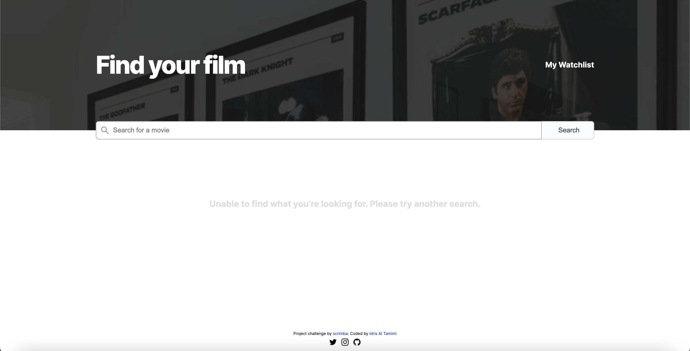
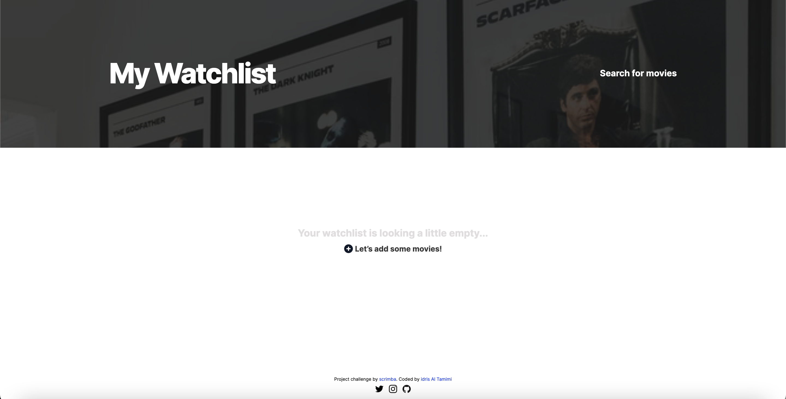
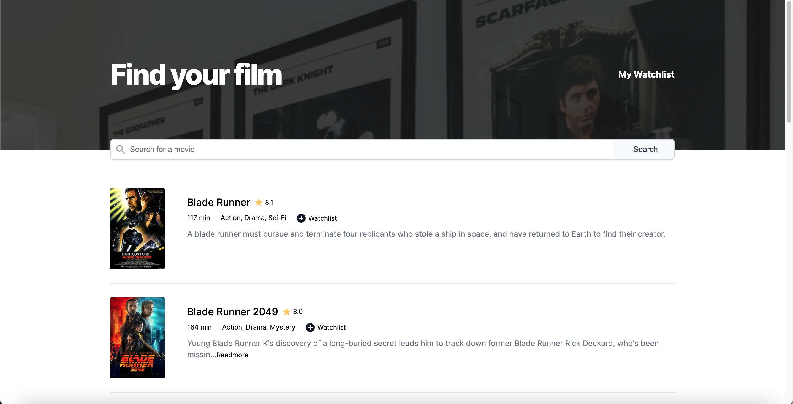
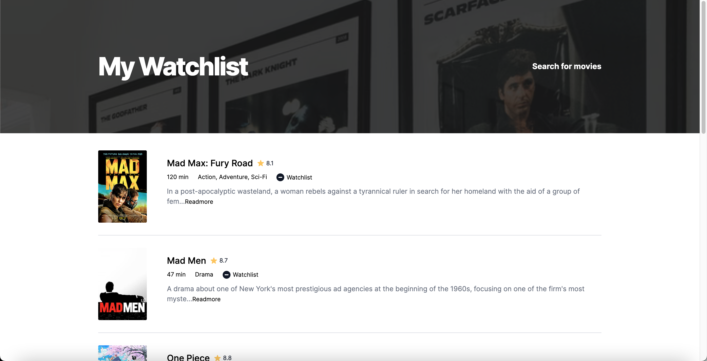
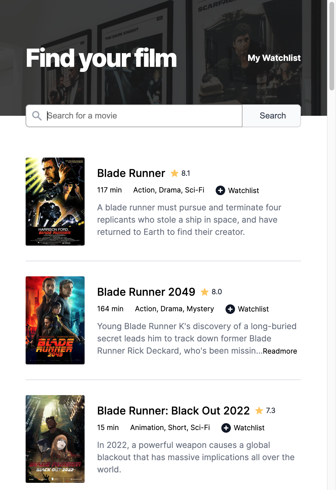

# Scrimba Challenge - Movies Watchlist

This is a solution to the Movies Watchlist app challenge on [scrimba](https://scrimba.com). Scrimba is a coding course platform that have interactive courses and tutorials.

## Table of contents

- [Overview](#overview)
  - [The challenge](#the-challenge)
  - [Screenshot](#screenshot)
  - [Links](#links)
- [My process](#my-process)
  - [Built with](#built-with)
  - [Useful resources](#useful-resources)
- [Author](#author)

## Overview

### The challenge

Users should be able to:

- Two pages - index.html and wachlist.html
- Index.html is the search page. calls OMDB API with the title searched and display search results.
- Button to "add to watchlist" which save that data to local storage.
- Watchlist.html loads and display data from local storage

### Screenshot

### Links

- Solution URL: [Solution URL here](https://github.com/idrisaltamimi/movies-watchlist.git)
- Live Site URL: [Live site URL here](https://idrisaltamimi.github.io/movies-watchlist/)

## My process

### Built with

- HTML5 
- CSS 
- JavaScript
- cloneNode js

### Useful resources

 [OMDb API](https://www.omdbapi.com).

## Author

- GitHub - [Idris Al Tamimi](https://github.com/idrisaltamimi)
- Twitter - [@idris_altamimi](https://twitter.com/idris_altamimi)
